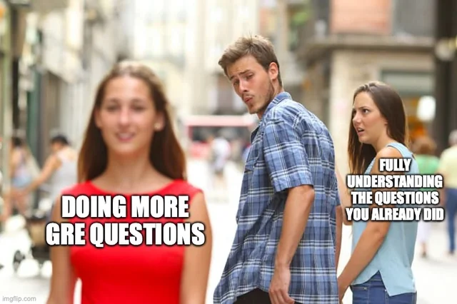

# How I prepared for the GRE (and why you should avoid repeating me)

Graduate Record Examinations - very intimidating name. You peek into its syllabus. Huh. Math and English. That doesn't seem so hard. You solve a few Quant (just call it math ETS, it ain't that deep) problems and you gain confidence (especially if you are an engineering student like me). You look up some Verbal problems - WTF. How and why am I supposed to know the meanings of words like _quixotic, lassitude and inveigle_?? This is just the start of a journey where your confidence will keep oscillating between "I HAVE BECOME DEATH, THE DESTROYER OF EXAMS" to "pls someone explain what is the answer of this RC question - i am confused between options C and D - wait, _answer is A???_". I am sharing my journey below hoping that it will help at least some of y'all to avoid the mistakes I made. 

## How the beginning was the root cause of my downfall (A New Hope)

As an engineering student, I am supremely confident in my Math skills - _"if I can solve fourier problems, what's algebra and arithmetic"_. I planned to complete Quant in a couple of weeks and then move onto Verbal (_shiver_). BIG MISTAKE. Never do Quant and Verbal separately. The exam is designed to evaluate how well you juggle quantitative and verbal reasoning together. There are four scored sections (five if you count AWA - _but who cares about that am I right?_) with Quant and Verbal spread across the test. On some days, I would be extremely motivated (50 correct answers in a row - _I am a genius_) and solve a large amount of questions while most other days I would be less enthusiastic (_do I really need to practice solving quadratic equations?_). Consistency was my biggest enemy and by the end of the third week, I had only adequately prepared for the first two quant sections with Geometry and Data Analysis still remaining. I had originally planned to give the GRE in six weeks with two weeks given to Quant and four for Verbal but now I was halfway through my prep time having done only the Arithmetic and Algebra, arguably the easiest parts of the entire exam. I was doomed. 

I had originally planned to give the GRE in the first week of August, with most of my prep time slotted in July, but by 20th July, I was still only halfway through Quant. I panicked. This was not necessarily the worst outcome since I also buckled up to grind it out but if I had been slightly more calm, I would have recognized that adhering to the original schedule was an impossibility. Nevertheless, I finished the rest of Quant in one week, completing tons of questions and concepts everyday. In hindsight, I probably rushed through it - focusing more on quantity and not quality - but hindsight is 20-20. Now that I had finished Quant, I was again in a dilemma. I had originally planned to finish a majority of preparation before my college began in August but now I am left with finishing the entirety of Verbal along with college. I am, once again, doomed. 

 

## The Comeback (Revenge of the Jedi)

I bit the bullet. Changing the exam date from the initially planned 10th of August to 1st of September gave me breathing space. I took one whole weekend planning exactly what I will do each week. On the same weekend, I attempted a free "diagnostic" test. I screwed up. A 165 in Quant and a 152 in Verbal might seem decent to most but considering the goals I had set for myself and the scores required for my target universities, this was abysmal. But this is exactly why I gave the test. It served as both a reality check and help my pinpoint my weaknesses exactly. 

I had no apparent conceptual problem in Quant; it was my mindset that was the issue. Never striving for perfection, I accepted that I can get a couple of "silly" mistakes in a small set of twelve or fifteen questions. This is not ideal. To get that top score close to 170, you HAVE to be immaculate. This is why I reserved one quant day after every three verbal days solely for practice tests and most importantly, question diagnosis. Why did I make a so-called silly mistake became a personal vengeance. Slowly, but surely, I began acing every quant test. I continued doing this till the end of my prep journey. 

Finally, coming to Verbal. From my diagnostic test, I knew I had to primarily improve in two major aspects - vocabulary and RC strategies. I had already nailed down the art of solving TC and SE questions - look at the question AFTER making pairs from the options for SE and figuring out the tense, PoS (Part of Speech) and connotation (positive/negative) associated with each blank for TC. The only SE and TC questions I erred in were the ones in which the meaning of a word in the question or the option itself were unknown. 

The RC questions were a major source of frustration for me since i) they contained highly academic texts, sometimes from niche domains like Art where I had little to no prior expertise or exposure of, ii) identifying what the question asked for (classifying the _type_ of question) and iii) the options of each medium-hard RC question were extremely similar to one another with almost every question containing an ingrain of "correctness". I gave in. I watched several RC strategy videos and learnt how to attack each and every type of question. This is where I devoted the majority of my prep time (but also proved the most fruitful in the end). 

 

## Test Day Drama (Revenge of the Sith)

I was done with most of the preparation by the last week of August and began giving practice tests every two days. I attempted six full length practice tests (including the two free PowerPrep and another two PowerPrepPlus tests provided by ETS) scoring an average of 168 in Quant and 158 in Verbal. Needless to say, I was supremely confident going into test day. The night before the exam, I revised the entirety of vocab, all major Quant concepts and formulae as well as all of my RC, SE and TC strategies. I was so pumped that I created a 'time management' sheet detailing exactly how much time I was going to devote for every type of question in all of the sections. I had already gone through a AWA strategy video and was getting adequate results. 

I began THE day by solving a mini-exam of 20 total Quant and Verbal questions. I aced every Quant question and got 8/10 in Verbal. Again, a boost to my confidence. I reached the test center early and noted that no one else was scheduled to give the exam with me (I asked). No distractions, yay! I noticed with relief that the headphone and keyboard provided by the center was of decent quality. 

I began the test. Standard AWA topic - I was able to conjure up reasons and examples quickly with a great hook. My confidence further increased as I moved through every Quant question recognizing every one of them as being similar to questions I had solved in the past. Brilliant. Verbal wasn't too hard but also not too easy. This wasn't a huge issue since I had planned for this and didn't need to ace every question. The second quant section was also quite normal albeit slightly lengthy. There were a couple of DA questions I probably should have checked again - but surely I won't make a silly mistake given the extensive preparation I had done (wink, wink). I was still so confident that I wrote on the rough sheet provided by the test center that I expected a 168 in Quant at least before moving onto the final section. The second verbal section proceeded in a similar manner as the first with some "hard" but expected questions. I was sufficiently happy by the end of the test and carefully chose to report the scores (why will anyone cancel the scores, ETS?). 

You probably realize that I am building up to a crescendo. You aren't wrong. I FLUNKED THE TEST - 159 in Verbal (decent and expected) but a 164 (!!!) in Quant. This was the lowest I had scored in all of my practice tests by a decent distance and actively hurt my profile instead of enhancing it since almost all of my target universities required a high Quant score (>=167) with more leeway given for Verbal but a strict margin for Quant. I was devastated since this meant that I had to either give a huge chunk of my future time retaking the test or exclude few universities entirely. 

## The Retake (The Force Awakens)

Given the current scenario for international students in most countries, I understood that I will have to mainly target the very best universities to get a decent ROI in this _adventure_. For this, I HAD to retake the GRE. But not right away. I decided to give the TOEFL first (article on this soon!) and then had to give my college mid-term examinations. This took twenty days. In the middle of all this, I stumbled upon an interesting quote, apparently said by the late Albert Einstein, which determined my approach for the retake - "Insanity is doing the same thing over and over again and expecting different results". Claiming this as my mantra, I decided to go against the grain and actively be as unprepared as possible (lol). That didn't mean that I didn't do _anything_ - I solved several ETS questions from their official books (goldmine this) but I didn't watch a single new (or old) strategy or conceptual video. I went through ETS Math Review for Quant and a small vocab sheet of difficult words for Verbal. That's it. I am, officially, insane. 

Night before the test day, I re-watched GoT S8. I figured Karma would help me here and the self-imposed punishment would yield a better result. _Have I mentioned that I am insane?_ Woke up listening to [God's Plan](https://open.spotify.com/track/6DCZcSspjsKoFjzjrWoCdn?si=14dace52ee274c40) and [Dear God](https://open.spotify.com/track/6U8OunNdqjWHh6zZzTjiBF?si=b650f6fecc834c38). I was vibing to [Hanuman Chalisa](https://open.spotify.com/track/6H7fLdt0AeWpuxUKXuXWrx?si=29d893d569614076) on the train to the center. A peculiar mood, indeed. As I reached the center, I felt much more anxious and stupid about my approach. There were 5-6 students ahead of me giving the test at the same time so more distractions (yay?). A much more vague AWA prompt. Not a great start. Moving onto the first Quant section, I felt anxious about a couple of problems but submitted it due to lack of time. Both the Verbal sections were similar to my original attempt albeit feeling slightly "easier". The second Quant section was so easy that I finished with ten minutes to spare. I cross-checked every question low-key wondering whether I had flunked the earlier Quant section and landed with an "easy" second section. Fully expected a <320, I reported the scores. _i aced the test - 170 Q, 162 V, 332/340 overall._ I was so surprised I disturbed the candidate besides me and quickly apologized. Only one thought ran through my mind as I exited the center - Einstein was a bloody genius! 

## The quest to find the perfect material (and why it is harder than finding a needle in a haystack)

One other thing I want y'all to note is that you should carefully choose the prep material you will use. I was confused between the notes and questions provided by the counselling service I had booked for the entirety of the "Study Abroad" (hint) journey, the official materials provided by ETS and other reputed external websites. Doom scrolling reddit didn't help me whatsoever. There is a ton of DECENT material available on the Internet, some of it free and some of it paid. My only advice would be to stick to any ONE of the resources available since the quality of the material doesn't really matter that much compared to the work you put in. I will, of course, suggest what material helped me but it REALLY doesn't matter. Just pick [one](https://pickerwheel.com). 

Ok enough dilly-dallying. Here's what I used and I recommend to use: [GregMat](https://www.gregmat.com) (I swear this post isn't sponsored). BUT, you don't have to go through every goddamn video or problem. You don't even have to follow the plans they recommend. I would actually advise against those plans. Note that this was particularly specific for my, an Indian CS Undergrad's, situation. This is what worked best for me: 

- Quant: Go through ETS's [GRE Math Review](https://www.ets.org/pdfs/gre/gre-math-review.pdf) and all of the questions from the official GRE books. If required, then only go through the timed Quant exams on GregMat. Personally, I didn't feel the need to go through any quant concept or strategy videos but you may use PrepSwift or Khan Academy's playlists. 
- Vocab: Use GregMat's app to learn vocab through the flashcards (laptop users can check [here]()). Thoroughly utilize the [Vocab Mountain](https://www.gregmat.com/mountains/vocab-mountain) feature for revision. Go through 20 groups at least - if possible, walk through all 34 groups but this is not a strict constraint - 25 groups are more than enough in my opinion. 
- RC: Watch at least the first six videos of [Greg's RC series](https://www.gregmat.com/course/dedicated-reading-season-3) along with at least three "Homework" solving sessions. Solve alongside. Keep doing official ETS questions side by side. 
- TC amd SE: Understand how TC and SE works; maybe watch one video of Greg's or Vince's live classes to understand how they approach these problems. Otherwise, only vocab can help you here. Again, keep practicing questions from the official ETS books. 

### Additional insights

- Luck is a major factor in these exams. Be calm if you don't get a good score in your first attempt. Statistics dictate that you will score well in your second. 
- Give regular practice tests to ascertain your progress. There are a ton of free tests available online - use them. Save the official ETS PowerPrep tests (and if economically possible, the PowerPrepPlus tests) for the end since they are closest to the actual GRE.  

## More Resources

- [Quant Flashcards by GregMat (truly the GOAT)](https://www.gregmat.com/course-group/quant-flashcards)
- [Quant Cheatsheet prepared by yours truly](https://gre-quant-tips-tricks.tiiny.site)
- [TargetTestPrep's Quant Cheatsheet](https://drive.google.com/file/d/1Fg_hNHQMN-RkYWOVqq1bIb7hjnW1BJkO/view)
- [Vocab "Difficult Words" Google Sheet made by me](https://docs.google.com/spreadsheets/d/1KEOBOUiUOyTtpg_aXdQV-ZOhC9XqVilLZVEQ5e0n4OY/edit?usp=sharing)
- [AWA Template](https://drive.google.com/file/d/1HgpntC54JawZYyl5ByNInLC8IVsPth25/view?usp=sharing) 

---

_Have questions or thoughts on this topic? Feel free to reach out via the [contact page](/contact.html)!_

---

<!-- **Related Posts:** [If you have related content, link to it here] -->
